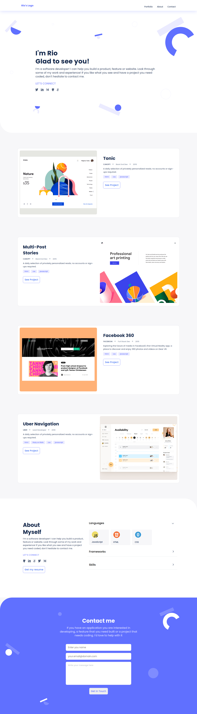

# My Portfolio Website

> My greatest portfolio starts early, and will evolve as I become better at my craft.

## Built With

- Major languages: HTML & CSS
- Frameworks: none
- Technologies used: git, GitHub

## Live Demo (if available)

[Live Demo Link](https://razvanso.github.io/portfolio)

## Authors

👤 **Rio**

- GitHub: [@razvanso](https://github.com/razvanso)
- Twitter: [@RioRazvan](https://twitter.com/RioRazvan)
- LinkedIn: [Razvan Rio](https://www.linkedin.com/in/razvan-rio/)

## 🤝 Contributing

Contributions, issues, and feature requests are welcome!

Feel free to check the [issues page](../../issues/).

## Show your support

Give a ⭐️ if you like this project!

## Acknowledgments

- README template from [Microverse](https://github.com/microverseinc/readme-template)
- Linter setup from [Microverse](https://github.com/microverseinc/linters-config/tree/master/html-css)
- Based on this [beautiful design](<https://www.figma.com/file/mkC0dUJBz0JnpcI4uZT3QX/Microverse-Student-Project-1-(Copy)?node-id=0%3A1>) provided by Microverse.

## 📝 License

This project is **[MIT](./LICENSE.md)** licensed.
